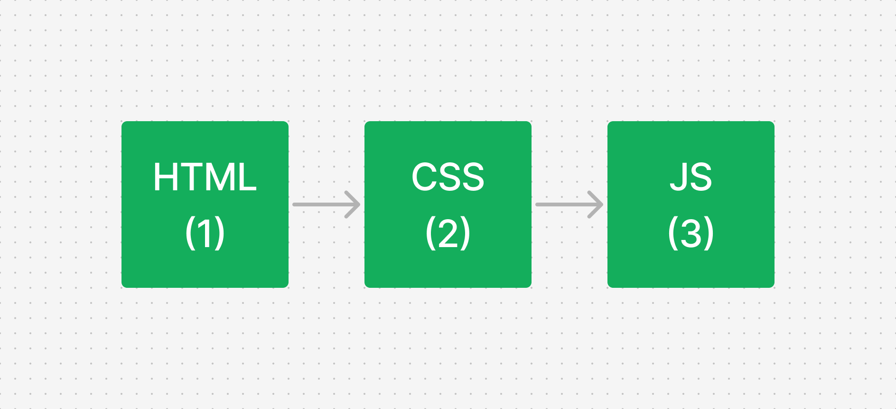

import {FormSandpack} from '../../components/contents/updates/web-development-with-progressive-enhancement/FormSandpack'

Have you ever opened some website, but it doesn&lsquo;t work on your ancient devices? It&lsquo;s kinda stressful isn&lsquo;t it when you try surfing on the internet you need to spend your money to buy a new device first. Well, if you feel that way, when building a website you need to pay attention to backward compatibility, so more users can use your websites smoothly without a problem. And that's where you need progressive enhancement when building websites for more accessibility and backward compatibility.

## Progressive Enhancement

Quoted from [MDN](https://developer.mozilla.org/en-US/docs/Glossary/Progressive_Enhancement) :

> Progressive enhancement is a design philosophy that provides a baseline of essential content and functionality to as many users as possible, while delivering the best possible experience only to users of the most modern browsers that can run all the required code.
> 

This means that with progressive enhancement, we can improve user experience regardless of their user agent. So, although the user opens it from IE 1, it can still work fine, with some features probably reduced (but what kind of psycho is using IE in this economy?).

As a web developer, we usually decide which baseline for the users of our websites, so we can easily maintain what kind of features we can deliver to our users baseline and the features we can&lsquo;t.

### Why is Progressive Enhancement Important?

Progressive enhancement is important when you are targeting a wider user base for your websites and want them to be accessible to older browser versions, and that should be your default approach when building websites, tho.

With that in mind, your websites can visited by any users from any background and maybe can increase your sales from specific customers. Customers with old browsers, customers with old devices, etc. Because, sometimes we never know where our customers come from, what are their economic condition, what are their internet speed and what are their special conditions they had.

***But, isn't it like we're making bad assumptions about the user's browser?***

Although the progressive enhancement objective is to improve backward compatibility and accessibility, we don&lsquo;t make assumptions or presume anything about our users. We just make sure our website still works fine in old browsers and has all the features available in modern browsers without sacrificing users' experience with old browsers.

### When Should I Care About Progressive Enhancement

Well, progressive enhancement is not a technology it&lsquo;s more about the developer's approach when building websites, you can choose to care about it or not but, I really recommend you to use it when creating a website. Specifically, when you are trying to target more customer/user base for your websites, this approach will help you with that.

## Difference with Graceful Degradation

When you were learning progressive enhancement, you will likely introduce to graceful degradation also. It has almost same philosophy with progressive enhancement, the differences are while with progressive enhancement we as a developer starting from basic and functional version of website first and then add more advanced features for modern web browsers and devices that support them, the graceful degradation *dictates* us to start from most advanced features for modern browsers and devices and add supports for less capable browsers or devices version by “degrading” certain features as needed.

So, by that explanation before, progressive enhancement is a bottom-up approach to web development while the graceful degradation is a top-down approach. You can be using progressive enhancement and graceful degradation at the same time to complement each other while building websites.

## Progressive Enhancement Layers



In that image, we can see we have 3 layers of progressive enhancement which is HTML, CSS and JavaScript. Those layers play important part for progressive enhancement and have different specification on each layer.

### HTML

HTML is the first layer of progressive enhancement, which has the largest support on any browsers. You can deliver your website with HTML in almost every browser (with some of the element have constrained for availability in some browser version).

HTML is a starting point when we're implementing progressive enhancement in our website, it is important because you need HTML to build your website layout and structure.

### CSS

You absolutely can build your website with only HTML, but in the ideal world your website should be having styles, and you MUST style your website damn it.

When it comes to CSS, we start to face compatibility issues more often. It&lsquo;s because there is larger new CSS features that comes recently than HTML, for example: [`@container` at-rule](https://developer.mozilla.org/en-US/docs/Web/CSS/@container) that released in 2023 and only supported by few browsers at the moment. But, CSS have [`@supports`](https://developer.mozilla.org/en-US/docs/Web/CSS/@supports) which give us some flexibility to choose which selector, properties and functions supported by browsers and the fallback when it doesn't.

The `@supports` rule is similar to media query but used as “feature detection” in CSS. You can using operators like `and`, `not`, and `or` even the CSS variables.

For example, you can check the support of grid with this code:

```css
@supports (display: grid) {
	.container {
		display: grid;
	}
}
```

Or, you want to check if the grid property doesn’t exist and the flex property is available:

```css
@supports (display: flex) and (not (display: grid)) {
	.container {
		display: flex;
	}
}
```

### JavaScript

Finally, we have the last part of the progressive enhancement layers, which is JavaScript. This is the most tricky part when implementing progressive enhancement because JavaScript API supports varies from browser-to-browser even though browser with same engine like edge and chrome.

Some people think when we implement progressive enhancement we cannot be using JavaScript at all, because they think JavaScript will be disabled by users most of the time, but disabling JavaScript is not a simple way by a regular user who doesn&lsquo;t understand how JavaScript works. Even though, we need to define baseline for our website how they behave when JavaScript enabled or disabled.

## Fallback and Backward Compatibility

Okay, but how we can make sure our users have the same experience even though they are using an old browser or device?

The answer to that question is ***fallback.*** Fallback is a substitute or alternative solution that ensures a feature or content is still available to users if the preferred or advanced version cannot be used.

This snippet showing how we maintain form compatibility when implementing progressive enhancement :

<FormSandpack />

As you can see in that playground we have two files that create basic forms with React.JS. Nothing special, just a basic form with styling but I added some conditions to support more backward compatibility :

- In the `App.tsx` the default behavior for the form is to directly call the POST endpoint without interference from JavaScript itself so it can still work even on older browsers. But, I added a condition to make the form submitted by JavaScript with `fetch` API so you can validate or manipulate data when the user submits the form. You can comment/uncomment on line 11 to see how to form behavior with and without `fetch` API.
- Moving to `App.module.css` I created basic CSS styling with the gap on each input and button. To create the gap I used `subsequent-sibling combinator` by default to support older browsers and then I added the `@supports` rule so when the user browser supports flex I&lsquo;ll use it instead.

That snippet only shows the basic part of progressive enhancement in React, you can explore by yourself by creating a new website project with progressive enhancement with/without UI library.

## Conclusion

Progressive enhancement is a great approach when you want to expand your user base and keep the accessibility of your website. But, you&lsquo;re free to decide whether to implement this approach or not considering its pros and cons.

At the end of the day, we always wanna build a website that works fine for all of our users, but we cannot restrict how our users use our website or what their browser or device version is. So, the best we can do right now is to minimize the problem even though our users used resources with limited support to our website.