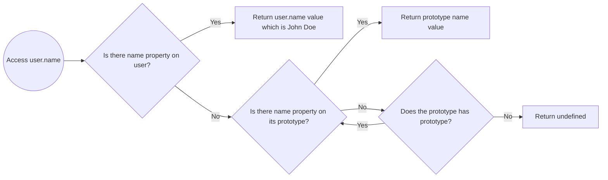

Hello 2026. I'm glad I finally have the time and the "will" to write again. This time I want to talk about JavaScript objects, because whether we like it or not, we use them everywhere (in our app I mean).

## Disclaimer

This article is not an "Objects 101" tutorial. I'm not going to walk through how to create objects, access properties, or other basics you can find anywhere. Instead, I want to focus on the stuff that actually matters once you've written JavaScript for a while: how objects behave under the hood, the gotchas around keys and prototypes, and the weird but useful parts like Symbols and iteration.

You may notice some code uses a playground and some doesn't. That's because a few snippets don't work properly when I drop them into the playground (and I'd need some time to fix that if I even feel like it 😛). So if you want to try them, please run them yourself, just copy-paste into your console and `console.log` the result. Most of them should run as-is.

---

## Object in a nutshell

An object is basically a bag of key–value properties. It's different from primitive types like `string`, `number`, or `boolean` because it can hold multiple values at once.

Let's say you have a `User` entity that usually contains `name`, `email`, `age`, `isVerified`, etc. Those fields typically span at least three data types (`string`, `number`, and `boolean`). Sure, you *could* store each value in its own variable but it's much cleaner to group them into a single object:

```js
const user = {
  name: "John Doe",
  email: "john@example.com",
  age: 20,
  isVerified: false,
};
```

Now the `user` variable holds everything in one place. You can access values with `user.name{:js}` and you'll get `John Doe`. If you want to remove a field, you can do `delete user.name{:js}` and the name key will be removed from the object.

Honestly, with just that, you can already build plenty of real apps. But, let's move to next section (or the real article section (I hope)).

---

## Let's start with `Object.prototype{:js}`

When people say "JavaScript objects are simple", they usually mean the syntax is simple. `{}{:js}` feels like a plain bag of data.

But JavaScript objects have one extra feature that changes everything, quoted from [MDN](https://developer.mozilla.org/en-US/docs/Web/JavaScript/Guide/Inheritance_and_the_prototype_chain):

> Every normal object has a hidden link to another object called its prototype.

That prototype link is why objects can inherit behavior, why some properties "exists" even when you didn't define them, and why you sometimes see "spooky" stuff during debugging such as `toString{:js}`, `hasOwnProperty{:js}`, etc.

So yes: a `prototype` is simply another object. Like MDN said, objects in JavaScript carry a hidden internal link to a prototype object. In spec terms, that link is often described as `<prototype>`.

A simple way to think about it:

> An object has its own properties, and a "fallback parent" it can consult when a property is missing.

That _fallback parent_ is the prototype.

### Where do prototypes come from?

Most of the time, you never set them manually so when you write:

```js
const o = {};
```

That object's prototype is `Object.prototype{:js}`, it comes by default from JavaScript. You can figuring out the prototype by simply: `console.log(Object.getPrototypeOf(o) === Object.prototype);{:js}`. And that's why this works:

```js
({}).toString();
```

Because you didn't define `toString{:js}`. `Object.prototype{:js}` did, and your object inherits it through the prototype chain. So a "plain object" is never truly empty. It always comes with a prototype... unless you deliberately remove it.

### But, why prototype?

(Why not?) It's a flexible and "cheap" way to share behaviour. If JavaScript copied all methods into every object, you'd end up with:

- A lot of duplicated functions in memory
- Messy updates (you'd have to update every object)
- Slower creation for lots of instances

Instead, JavaScript uses delegation:

> If you don't find the property on me then check my prototype

### How the prototype behave?

Let's say you are using the user object above and trying to access the `name` property like this `user.name{:js}`. JavaScript basically does a lookup operation like this:



That flowchart shows how the prototype behaves and this is what people call the prototype chain. Here's some demo code:

```js
const user = {
  name: "John Doe",
  email: "john@example.com",
  age: 20,
  isVerified: false,
  __proto__: {
    hidden: 'Hidden Value'
  }
}

// or create the prototype with Object.create like this
const user2 = Object.create(user)

console.log(user.name) // John Doe
console.log(user.hidden) // Hidden Value
console.log(user.notFound) // undefined

console.log(user) // User object and it's prototype
console.log(user2) // Empty object with the user object properties in it prototype
```

You'll see something like this:

<figure>
  <Image
    src="https://res.cloudinary.com/alfanjauhari/image/upload/updates/javascript-object-and-its-friends/object-result.avif"
    layout="fullWidth"
    alt="Console log result from user object"
    title="Console log result from user object"
  />
  <figcaption>console.log(user) result</figcaption>
</figure>

We'll focus on `console.log(user){:js}`, which can look a bit strange the first time you see it. That log shows the user object plus its prototype. And you can see we even have a nested prototype, because we declared `__proto__{:js}` inside our `user` object.

So when we try to get a value from a JS object (in this case `hidden` from `user`), JavaScript does something like this:

1. Check whether `user` has an own property named `hidden`.
2. `user` does not, so check its prototype.
3. The prototype has `hidden`, return it.

This lookup is recursive means JavaScript will keep walking up the chain until it finds the property, or the prototype becomes `null`. That means you can have multiple levels of prototypes, but deeper chains can also affect lookup performance.

### Prototype shadowing

Now let's remove the `__proto__{:js}` object inside our `user`:

<Sandpack tabs="console">
  <SandpackFile name="/index.ts">
  {`const user = {
    name: "John Doe",
    email: "john@example.com",
    age: 20,
    isVerified: false
  }

  console.log(user)`}
  </SandpackFile>
</Sandpack>

In the code above you'll see the user object only contains one prototype, which is the default JS prototype that contains multiple property we can use such as `toString{:js}` which used for _stringify_ the object (if you call that function you'll see something like `"[object Object]"{:js}`) its a JS default object prototype.

And here's the fun part: you can override (shadow) those default prototype methods by defining the same property on the object itself:

<Sandpack tabs="console">
  <SandpackFile name="/index.ts">
  {`const user = {
    name: "John Doe",
    email: "john@example.com",
    age: 20,
    isVerified: false
  }

  user.toString = () => {
    return 'Hello string!'
  }

  console.log(user.toString())`}
  </SandpackFile>
</Sandpack>

So when you trying to call `user.toString(){:js}` it will return `Hello string!` instead `"[object Object]"{:js}` from our object. Simply lovely!

### And these, some of prototype "catches"

1. Prototype != copying

    This is important because many devs (understandably) think inheritance means copying. In JavaScript, inheritance is simply delegation. The child object doesn't "contain" the parent's properties. It just knows where to look when it can't find something. That's why if multiple objects share a prototype object, and you mutate that prototype, you affect all of them:

    <Sandpack tabs="console">
      <SandpackFile name="/index.ts">
      {`const proto = {
        greet() {
          return "hi";
        }
      };

      const a = Object.create(proto);
      const b = Object.create(proto);

      proto.greet = () => "hello";

      console.log(a.greet()); // "hello"
      console.log(b.greet()); // "hello"`}
      </SandpackFile>
    </Sandpack>

    You can see the `a.greet(){:js}` and `b.greet(){:js}` return the same value which is `hello`, that is because the a and b object share the same prototype.

2. It exists vs it's mine

    This is one of those tiny distinctions that prevents real production bugs when we trying to check if the object has a property or not.

    ```js
    const user = {
      name: "John Doe",
      email: "john@example.com",
      age: 20,
      isVerified: false,
      __proto__: {
        hidden: "Hidden!",
      },
    };

    console.log("hidden" in user); // true
    // could be `user.prototype.hasOwnProperty('hidden')`
    console.log(Object.hasOwn(user, "hidden")); // false
    console.log(Object.hasOwn(user, "name")); // true
    ```

    But why this is matters? Imagine you're validating incoming data:

    ```js
    if ("role" in payload) {
      // ...
    }
    ```

    If payload has a weird prototype (or your intern has their own mind to write JS object), "role" in payload might be true even when it shouldn't be. That's why my default answer for "does this object actually contain this field?" is `Object.hasOwn(object, key){:js}` which is more direct and it matches what you usually mean.

3. `for...in{:js}` walks inherited enumerable properties
    <Sandpack tabs="console">
      <SandpackFile name="/index.ts">
      {`const parent = { inherited: 1 };
      const child = Object.create(parent);
      child.own = 2;

      for (const k in child) {
        console.log(k); // "own" then "inherited"
      }`}
      </SandpackFile>
    </Sandpack>

    So, if you only want to get the own keys, prefer `Object.keys(){:js}` or `Object.entries(){:js}`.

4. You can create object without prototype (if you want to)

    Yes, we can create object without prototype by simply using `Object.create(null){:js}` and assign the prototype easily.

---

## `Map{:js}` for more flexible data

As you read earlier, JS objects only support string/symbol(we'll discuss symbol in the next part) keyed properties. So if you try this:

```js
const obj = Object.create(null)

obj[0] = 'First'

console.log(obj[0]) // First
console.log(obj['0']) // First
```

`[0]` and `['0']` return the same value because JavaScript converts keys to strings. Only `symbol{:js}` doesn't get converted.

Another example: using an object as a key:

<Sandpack tabs="console">
  <SandpackFile name="/index.ts">
  {`const obj = Object.create(null)
  obj[{ name: 'Name Value' }] = 'First'

  console.log(obj) // { "[object Object]": "First" }`}
  </SandpackFile>
</Sandpack>

That result is expected because JavaScript stringifies object keys, and _stringifying_ an object returns `[object Object]{:js}`. Even if you add a different object key `obj[{ age: 19 }] = 'Second'{:js}`, JavaScript still treats it as the same property key after stringification.

That behavior makes objects a poor fit for a "true hash map", where keys can be _anything_, not just strings. And that's where `Map(){:js}` comes in.

### Difference between `Map{:js}` and `Object{:js}`

`Map` is similar to `Object` in a few ways:
- It stores key/value pairs
- Their keys are unique
- You can retrieve, set and delete entries

The main differences is Map doesn't come with any other things by default, while objects often come with a prototype (if we declare the object by `{}{:js}` or `Object.create(obj){:js}`), also it could have a key by any primitive and object type instead of string or symbol only.

Honestly, those aren't the only differences, but to keep this section aligned with the article topic, I'm focusing on the two that matter most here. If you want the full comparison, check [MDN docs for JavaScript Map](https://developer.mozilla.org/en-US/docs/Web/JavaScript/Reference/Global_Objects/Map#objects_vs._maps).

### Using `Map`

You can write Map in two ways:

1. Declare the map variable with `new Map()` and then assign the property.
    ```js
    const map = new Map();

    map.set(1, 'First')
    map.set('hello', 'World');
    ```

2. Directly pass the array of key-value collection to Map constructor.
    ```js
    new Map([
      [1, "First"],
      ['hello', 'World']
    ]);
    ```

Those code will return the same Map that contains `1` and `hello` key. You can see that map contains two key with different types which is `number{:js}` and `string{:js}`.

### Retrieving, deleting, and checking values

Once you have a `Map{:js}`, the API is pretty straightforward:

- `map.get(key){:js}` to read
- `map.set(key, value){:js}` to write
- `map.delete(key){:js}` to remove
- `map.has(key){:js}` to check existence
- `map.clear(){:js}` to wipe everything

```js
const map = new Map([
  [1, "First"],
  ["hello", "World"],
]);

console.log(map.get(1)); // First
console.log(map.get("hello")); // World

console.log(map.has(2)); // false

map.delete(1);
console.log(map.has(1)); // false
```

Notice `Map` forces you to be explicit. So you don't need to guess the output from `Map` because no more _stringifying_ key fellas.

### Iterating a `Map{:js}`

One of the most underrated perks of `Map` is: it's iterable by default. It means you can just throw `for...of` at `Map` like this:

```js
const map = new Map([
  [1, "First"],
  ["hello", "World"],
]);

for (const [key, value] of map) {
  console.log(key, value);
}
```

And yes, the entries come out as `[key, value]` pairs, which is exactly how you usually want to loop over a key/value structure.

You can also be more explicit:

```js
for (const key of map.keys()) console.log(key);
for (const value of map.values()) console.log(value);
for (const entry of map.entries()) console.log(entry);
```

If you compare this to objects, you usually end up doing:

```js
for (const [k, v] of Object.entries(obj)) {
  console.log(k, v);
}
```

Well, that is 100% fine, but with `Map` it's a built-in feature and you can write more explicit code with that.

### But, objects can be iterated too, right?

If you mean "loop over keys", then yes, `for...in` does that:

<Sandpack tabs="console">
  <SandpackFile name="/index.ts">
  {`const obj = {
    hello: 'World',
    name: 'Alfan'
  }

  for (const o in obj) {
    console.log(o) // hello, name
  }`}
  </SandpackFile>
</Sandpack>

But notice: `for...in` iterates keys, not `[key, value]` pairs. And it's also enumeration, not the iterable protocol that powers `for...of`. Plain objects don't implement the iteration protocol, so `for...of` throws unless you:

1. Explicitly convert them into something iterable (like `Object.entries(obj){:js}`), or
2. Implement `[Symbol.iterator]{:js}` yourself (we'll come back to this in the next section when we talk about `Symbols` especially `Symbol.iterator{:js}`), which is what JavaScript checks to decide whether something is iterable

### When to choose `Map{:js}` over `Object{:js}`?

Honestly it depends to your needs. But, for myself I'll use `Map{:js}` if:

1. My keys are not naturally strings (numbers, objects, tuples-ish structures)
2. I'll be adding or remove keys a lot
3. I need reliable iteration without extra conversion
4. I'm lazy

And I'll choose `Object{:js}` over `Map{:js}` if:

1. The data is more like a "record" with a stable shape such as `user.name{:js}`, `config.timeout{:js}`, or
2. I'm expecting to serialize it to JSON

So yeah, if you want a more flexible, more "real collection" key/value structure, `Map` is usually the better tool. And since this article is titled _JavaScript Objects and Their Friends_, I think `Map` only qualifies as a pretty close friend (which is why I'm not gonna explain `Map` deeper 😁).

---

## `Symbol{:js}` this `Symbol{:js}` that

Aight, now we've covered `Object` and `Map`. Earlier I mentioned one important limitation of objects:

> Object keys are basically string/symbol. And most values you use as keys get coerced into strings.

That conversion is why this happens:

```js
const obj = Object.create(null);

obj[0] = "First";
obj["0"] = "Still First";

console.log(obj); // { "0": "Still First" }
```

JavaScript treats `0` and `"0"` as the same key because it converts non-symbol keys into strings.

Symbols exist partly to solve this. They're keys that don't get coerced into strings, and they don't accidentally collide with your normal keys.

A `Symbol{:js}` is a primitive type that produces a unique value every time you create it even if you give it the same description.

```js
const a = Symbol("id");
const b = Symbol("id");

console.log(a === b); // false
```

Comparison above return false because when we declare symbol JavaScript will be create a unique identifier, even you are define as much Symbol it still unique and cannot collide to each other. Also you can add description to symbol by simply write `Symbol('description'){:js}` but it's only useful for debugging because it doesn't add identity or another value for the symbol itself.

So we can agree this is the simplest way to think about Symbols:

> A Symbol is a "safe key" you can attach to an object without worrying about name collisions.

### "Invisible" data

Symbols shine when you want to attach extra information to an object without turning that information into part of the "surface" area. In real code, this happens more often than you'd think maybe when you build a tiny library, you return an object with a nice API, and you need to stash some internal state somewhere: a cache, a timestamp, a plugin context, a counter, a reference to the original config. If you use normal string keys for that (`_internal`, `_meta`, `__state`), it works... until it doesn't. Users can accidentally overwrite it, your internal keys show up in logs and `Object.keys(){:js}`, and at some point you're stuck defending your "internal" naming convention forever (okay that too much, but could be happen, right?).

A `Symbol{:js}` key "overcome" that whole mess. It gives you a property name that won't collide with normal keys and could be "invisible" in some ways. So your object can carry internal baggage without looking heavier from the outside (if that the right analogy (idk)).

### `Symbol.for{:js}` and `Symbol.keyFor{:js}` when you *want* a shared Symbol

By default, `Symbol(){:js}` always creates a fresh Symbol. That's why the "invisible data" pattern works so nobody can override your internal slot unless they already have the exact Symbol reference.

Sometimes though, you want different modules (or different copies of a library) to agree on the *same* `Symbol` key without passing it around manually. And that's what `Symbol.for{:js}` does. It looks up a Symbol in the **global Symbol registry** using a string key, and returns the same Symbol every time.

```js
const A = Symbol.for("my-lib.internal");
const B = Symbol.for("my-lib.internal");

console.log(A === B); // true
```

This is useful when you're building something that can be extended from the outside plugins, devtools integrations, cross package contracts where sharing a key is not so "risky" (or harmful).

Let's say you want plugins to attach diagnostics to a store, and you want your core library to be able to read it even if the plugin is loaded separately.

```js
const DIAGNOSTICS = Symbol.for("store.diagnostics");

export function attachDiagnostics(store, data) {
  store[DIAGNOSTICS] = data;
}

export function readDiagnostics(store) {
  return store[DIAGNOSTICS];
}
```

Now both sides can "meet" on the same key without importing the same constant file so its handy in monorepos, plugin ecosystems, or when multiple bundles might exist.

`Symbol.keyFor{:js}` goes the other way, when we given a Symbol from the registry, it'll returns the registry key.

```js
const sym = Symbol.for("store.diagnostics");
console.log(Symbol.keyFor(sym)); // "store.diagnostics"
```

But, `Symbol.keyFor{:js}` only works for Symbols created via `Symbol.for{:js}`. For normal Symbols, it returns undefined:

```js
console.log(Symbol.keyFor(Symbol("x"))); // undefined
```

In practice, I will use normal `Symbol(){:js}` for a private-ish internals and `Symbol.for(){:js}` for a shared contracts across boundaries. Use the registry deliberately, because once the key becomes "public", other code can access that too.

### How to use Symbol, or where should we use it?

Imagine you have a JS library, maybe some logger or whatever it is that using a object as a options to overrides the behaviour of your library. I'll use simple state management that have a initial state and we don't want the internal plugin data leaking to our user:

<Sandpack tabs="console">
  <SandpackFile name="/index.ts">
  {`export function createStore(initialState, options) {
    const STATE = Symbol("state");
    const INTERNAL = Symbol("internal");

    return {
      getValue() {
        return this[INTERNAL][STATE];
      },
      override(value) {
        this[INTERNAL][STATE] = value;
      },
      [INTERNAL]: {
        [STATE]: initialState,
        createdAt: Date.now(),
      },
      ...options,
    };
  }

  const store = createStore({
    hello: "World",
  });

  console.log(store.getValue()); // { "hello": "World" }

  const newStore = createStore(
    {
      hello: "World",
    },
    {
      getValue() {
        return "Overrided getValue() implementation";
      },
    },
  );

  // this is not gonna work
  const overrideInternalState = createStore(
    {
      hello: "World",
    },
    {
      [Symbol("internal")]: {
        overrided: true,
      },
    },
  );

  console.log(overrideInternalState.getValue()) // still { "hello": "World" }`}
  </SandpackFile>
</Sandpack>

You can see the `newStore.getValue(){:js}` implementation can be overrided by the user simply by passing new `getValue(){:js}` option but, the internal state couldn't changed even you know the symbol description.

Your internal state lives behind `[INTERNAL]{:js}` and `[STATE]{:js}` keys, which are Symbols. Even if someone "guesses" the description `"internal"`, they're still creating a *different* Symbol, so they won't hit your internal slot. In practice, this keeps your internal storage from being accidentally replaced by userland options, while still letting users override the parts you meant to be overrideable.

Symbol-backed fields also doesn't show up in `Object.keys(){:js}`. So if someone prints your store object, they'll mostly see the public API (`getValue`, `override`, etc.), not your internal data. When you do want to inspect everything during debugging, `Reflect.ownKeys(store){:js}` will show both string keys and symbol keys.

At this point, Symbols should feel less like a "random JS trivia" and could be a practical tool where you can hide internal wiring without bother other code will be break your code and you can share a key across packages when you actually want a shared contract.

Now there's one more reason Symbols matter, and it's a big one (I guess).

JavaScript itself uses Symbols as *hooks* to enable language features. These are called **well known symbols**. It is a "system" symbols used by JavaScript internally, and we can use them, or maybe re-implementing it by ourselves, such as:

- `Symbol.asyncIterator{:js}`
- `Symbol.iterator{:js}`
- `Symbol.replace{:js}`
- `Symbol.seearch{:js}`
- `Symbol.toPrimitive{:js}`
- `Symbol.hasInstance{:js}`
- ...

But, in this article I want to focus on `Symbol.iterator{:js}`.

---

## `Symbol.iterator{:js}`

You've probably seen this error at some point:

```js
for (const x of { a: 1, b: 2 }) {}
// TypeError: object is not iterable
```

Meanwhile this works fine:

```js
for (const x of [1, 2, 3]) {
  console.log(x) // 1 2 3
}
```

That's because arrays is *iterable* and in JavaScript, a value is called iterable when it implements the _iterator protocol_ and it checks for one specific hook which is `value[Symbol.iterator]{:js}`. That iterator must expose a `next(){:js}` method and each call to `next()` returns an object with two fields: `value` and `done`. The `value` is the next item in the sequence, and `done` tells JavaScript whether the sequence has finished. As long as `done` is `false`, `for...of` keeps going and uses `value` as the loop variable. Once `done` becomes `true`, the loop stops.

Arrays work with `for...of` because they already implement this protocol. Plain objects don't, so JavaScript has no built in to iterate over `{}` unless you convert it first (like `Object.entries(obj){:js}`) or implement `Symbol.iterator{:js}` yourself.

So, basically when you write this:

```js
const something = [1, 2, 3]
for (const item of something) {}
```

JavaScript does these thing:

1. Look for `something[Symbol.iterator]{:js}`
2. Call it to get an iterator
3. Keep calling `iterator.next(){:js}` to pull values one by one
4. And stop when `next()` returns `{ done: true }`

### Let's try making a plain object iterable

Like I said earlier, a plain object doesn't come with `Symbol.iterator{:js}`. That's why `for...of` throws on `{}` by default. But, lets try to experiment by implementing `Symbol.iterator{:js}` in object by ourselves.

At the simplest level, writing an iterable means returning an **iterator** which is an object with `next(){:js}` method that produces `{ value, done }`. The iterator keeps track of its current position, returns the next value, and eventually says if they already completed.

Here's a minimal example that iterates from `start` to `end`:

```js
const iterable = {
  start: 1,
  end: 5,
  [Symbol.iterator]() {
    let current = this.start;
    const end = this.end;

    return {
      next() {
        if(current <= end) {
          return { value: current++, done: false };
        }

        return { value: undefined, done: true };
      }
    }
  }
}

for (const i of iterable) {
  console.log(i) // 1 2 3 4 5
}
```

It's a great way to understand the iterator protocol. The downside is that it gets "messy" quickly especially when you want to iterate entries like `[key, value]`, or when your iteration logic gets more complex (which is always).

That's where generator functions shine. They let you write iteration logic in a natural, readable style, while JavaScript handles the everything else for you.

Here's some simple code that shows how generator works to iterate the `user` object entries:

```js
const user = { hello: "World", name: "Alfan" };

user[Symbol.iterator] = function* () {
  for (const entry of Object.entries(this)) {
    yield entry;
  }
};

for (const [k, v] of user) {
  console.log(k, v);
}
// hello World
// name Alfan
```

A generator (`function*{:js}`) is the easiest way to implement this because it builds the iterator for you. Each yield becomes one step in the iteration.

Now the object works naturally with `for...of`, spread, destructuring, and anything else that consumes iterables:

```js
console.log([...user]);
// [["hello","World"],["name","Alfan"]]
```

---

## So, which one should you use and why?

In practice, I treat these three like a different tools and not interchangeable "JS data structures", it comes with different purpose or you might using them at the same time.

- If the data feels like a **record** with a stable shape that you'll read/write with dot access (`user.name{:js}`, `config.timeout{:js}`), pass around, maybe serialize to JSON then a plain `Object{:js}` is still the most fit for me.

- If the data feels like a **collection**; keys are dynamic, you add/remove entries a lot, you care about iteration, or your keys aren't naturally strings, then `Map{:js}` usually makes the code cleaner. `Map` doesn't secretly _stringify_ keys, it gives you `size`, and iterating it is a easy thing instead of "convert to entries first and then loop".

- If you need to attach **internal metadata** to an object (state, plugin data, diagnostics, cache timestamps) without turning it into part of the public surface, then `Symbol{:js}` keys are a really nice move. You avoid key collisions, you avoid leaking internal fields into `Object.keys(){:js}`, doesn't want the "old" naming-convention (`_internal`, `__meta`, etc.). And when the key needs to be shared across modules or bundles, `Symbol.for{:js}` gives you a deliberate "global contract" key.

- And for iteration specifically, if you're building a custom structure that genuinely wants to behave like a collection, implementing `Symbol.iterator{:js}` makes it plug into `for...of`, spread, and other iterable consumers. For plain record objects, I usually just loop over `Object.entries(obj){:js}` which is more known by other people (and simple).

So basically objects for simple key/value records, maps for real key/value collections, symbols for internal wiring, and iterators when you want a type to participate in the language's iteration protocol.

## Summary

From the outside, JavaScript objects really _do look simple_. They feel like a _harmless_ little key/value collection that just sits there and behaves (lol). And most of the time, that's enough until it isn't. Under the hood, there's a bunch of _machinery_ that quietly shapes how objects behave suych us the prototype chain, property lookup, enumeration rules, and the odd little "hooks" that JavaScript uses to decide what an object can do. Honestly, I've used JavaScript for more than five years and still had a few "wait... that's how it works?" moments.

On the other side of the story, `Map` exists for a reason. Objects can work as dictionaries, but they come with assumptions that make them unreliable for certain workloads. `Map` feels more suitable when your data is truly a collection where it doesn't _stringify_ keys behind your back, has a built-in iteration, and it scales better as a "real" key/value structure. It's more full-featured, sure, but I'm not here to tell you what to use just to make the tradeoffs obvious.

And somewhere along the way, objects introduce you to another JavaScript type that's easy to ignore until you need it, `Symbol`. Symbols are great for internal metadata, plugin-style state, and global registry contracts when you want something unique (or deliberately shared via `Symbol.for`). They also connect to bigger JavaScript mechanisms `Symbol.iterator` which is one of the clearest examples of how the language uses Symbols as signals to tell JavaScript this thing is iterable.

At the end of the day, JavaScript is a weird language in a charming, sometimes frustrating way. It has _thousand_ methods, types, and protocols than most of us will ever memorize. But it's also *the language of the web*, and you don't really get to opt out. So learning the "boring internals" when you need them is part of the deal... even if none of us actually want to learn every corner of it "end to end".

Thanks!
